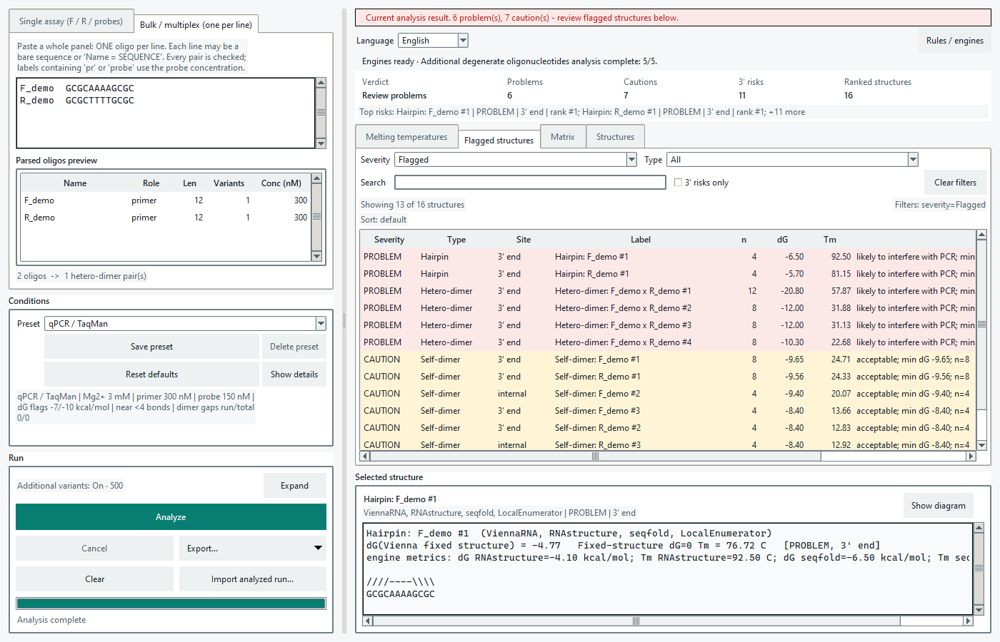

# MBUprime StructLab

MBUprime StructLab screens PCR and qPCR oligonucleotides for dimers and hairpins.
Analyze a single assay or a multiplex panel. Analysis runs locally; sequences and
results are not uploaded to an external service.

**[Download for Windows x64 — latest release](https://github.com/ilyakichigin92/MBUprime-StructLab/releases/latest)**
· [v2.4.5 release notes and SHA-256 files](https://github.com/ilyakichigin92/MBUprime-StructLab/releases/tag/v2.4.5)
· [User guide](docs/user-guide.md) · [Report an issue](https://github.com/ilyakichigin92/MBUprime-StructLab/issues)

The Windows ZIP includes Python and all four scientific engines. It is **unsigned**:
Windows security controls may ask for confirmation or block it under local policy.
Download from this repository and compare the ZIP with its published SHA-256 sidecar.
Hashes identify file contents; they do not authenticate a publisher.

The actual English v2.4.3 source GUI shows the [small synthetic example](examples/small-panel/README.md),
with flagged structures and a hairpin detail. This is not a frozen-executable
screenshot or a validated PCR assay.

## Try a small panel

1. Download and extract the entire ZIP into a short ASCII-only path such as
   `C:\MBUprimeStructLab`. Keep `MBUprime StructLab.exe` beside `_internal`, then
   open the executable. No separate Python installation is needed.
2. Choose **Bulk / multiplex** and paste the two lines from
   [bulk.txt](examples/small-panel/bulk.txt). Keep the default reaction conditions.
3. Select **Analyze**, inspect the result tables and a structure diagram, then
   export a text, CSV or TSV report. Compare with the
   [executed example and result summary](examples/small-panel/README.md).

The desktop opens in English; Russian is available in the language selector.
For command-line work, use the [CLI reference](docs/cli.md) after
[source setup](docs/development.md).

## What you can inspect

- Oligonucleotide melting temperatures using SantaLucia and Owczarzy corrections.
- Hairpins and self-/heterodimers, pairing geometry, engine-specific free energies,
  available structure melting temperatures, and screening severity.
- Multiplex dimer matrices, IUPAC variant coverage, local condition presets,
  report exports, and saved analyzed runs that can be reopened without recalculation.

Primer3, ViennaRNA, RNAstructure and seqfold are mandatory; seqfold evaluates
hairpins only. LocalEnumerator generates additional candidates. See
[methods and interpretation limits](docs/methods.md).

## Requirements and limits

The publicly supported distribution is Windows x64. Executed host evidence is
Windows 10 22H2 build 19045; clean Windows 11 qualification remains pending.
Ubuntu desktop/CLI and macOS CLI routes are **unverified**; see
[platform status](docs/platforms.md) and [validation scope](docs/validation.md).

Inputs are unmodified DNA, 5–60 bases per oligonucleotide, with at most 256
concrete variants per oligonucleotide. Chemical modifications are not modeled.
Budgeted degenerate analysis may be partial; coverage is reported explicitly.
Large panels require quadratic pairwise work and growing memory, and completed
GUI tables can pause interaction. Predictions are screening aids, not guarantees
of assay performance. Windows requires an ASCII-only resolved application path.

## Documentation and support

[User guide](docs/user-guide.md) · [Scientific methods](docs/methods.md) ·
[CLI reference](docs/cli.md) · [Development and tests](docs/development.md) ·
[Architecture](docs/architecture.md) · [Release builds](packaging/RELEASE.md)

For bugs, provide the version, OS, steps and a small synthetic reproducer through
[Issues](https://github.com/ilyakichigin92/MBUprime-StructLab/issues).
Avoid posting private sequences or unsanitized analyzed-run archives.
See [contribution guidance](CONTRIBUTING.md) and
[release history](https://github.com/ilyakichigin92/MBUprime-StructLab/releases).

## Citation and license

Use [CITATION.cff](CITATION.cff) to cite this software, and record the version,
scientific policy, reaction conditions and coverage with reported analyses.
No software paper or DOI is claimed.

GNU GPL version 2: [COPYING](COPYING). See
[third-party notices](THIRD_PARTY_NOTICES.md),
[corresponding source](CORRESPONDING_SOURCE.md), and
[license history](docs/license-history/README.md).
